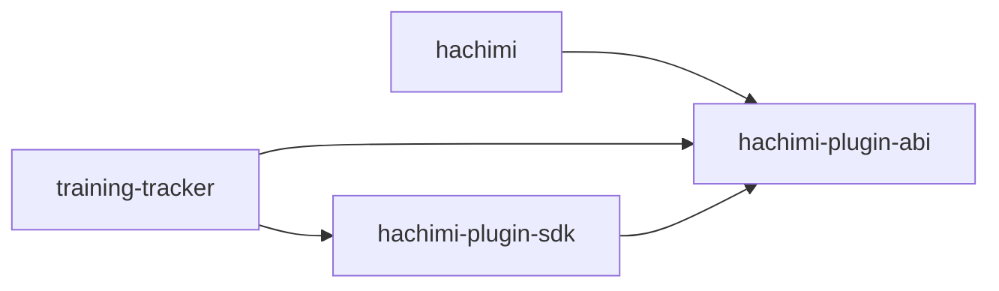

# Alternative B — Split crates: `hachimi-plugin-abi` + `hachimi-plugin-sdk`

**Codename**: `split-crates`  
**Status**: Alternative to [.plans/hachimi-plugin-sdk.md](hachimi-plugin-sdk.md)  
**Date**: 2026-05-23

Phases are sequential checkpoints. After each: `cargo build`, `cargo test`, `cargo clippy`.

---

## 1. Idea

Separate **stable ABI surface** from **ergonomic helpers**:

| Crate | Contents | Dependents |
|-------|----------|------------|
| `hachimi-plugin-abi` | `Vtable`, opaque types, `InitResult`, `API_VERSION`, `set_vtable`/`vt()`, `hlog!` macros | Host, every plugin (required) |
| `hachimi-plugin-sdk` | `Sdk`, `ApiVersion`, `gui`/`il2cpp`/`hook` safe wrappers | Plugins that want ergonomics (optional) |

Host depends **only** on `hachimi-plugin-abi`. Training-tracker depends on **both** (abi for init, sdk for migration).

Plugins that need minimal binary size or want zero abstraction can use **abi-only** and keep raw `(vt.slot)(...)` locally.

---

## 2. Goals

1. **ABI crate stays tiny** — fast compile, few deps, rare changes, semver-frozen mindset.
2. **SDK crate can evolve** — wrapper signatures, helper modules, without implying ABI bump.
3. Delete `vtable.rs` in plugins — replaced by `abi`, not a monolithic sdk.
4. Clear story for third-party plugins: “depend on abi; add sdk if you want sugar.”

## 3. Non-goals

- Two different `Vtable` definitions (sdk re-exports abi::Vtable only).
- Codegen / manifest (manual sync in abi crate — same as baseline single crate).
- Host depending on `hachimi-plugin-sdk`.

---

## 4. Dependency graph



---

## 5. Layout

```
crates/hachimi-plugin-abi/
  src/lib.rs    # Vtable, init, log macros
crates/hachimi-plugin-sdk/
  src/lib.rs    # pub use abi::*; Sdk, gui, il2cpp, hook
```

Workspace members: `.`, `crates/hachimi-plugin-abi`, `crates/hachimi-plugin-sdk`, `plugins/training-tracker`.

---

## 6. Phases

| Phase | Work |
|-------|------|
| 0 | Workspace + `abi` crate with full `Vtable` + tests |
| 1 | Host uses `abi` only |
| 2 | Plugin: `abi` replaces `vtable.rs`; still raw `vt()` calls |
| 3 | Add `sdk` crate; training-tracker adds path dep; `Sdk::init` |
| 4 | Migrate modules to sdk wrappers incrementally |
| 5 | Docs: when to use abi-only vs sdk |

**Checkpoint win**: Phase 2 alone fixes drift — smaller than baseline Phases 0–3 before ergonomics.

---

## 7. Tradeoffs

| Pros | Cons |
|------|------|
| ABI stability isolated from helper churn | Two crates to version and document |
| Optional weight for future minimal plugins | Slightly more workspace boilerplate |
| Host compile graph doesn’t pull sdk | Still manual `Vtable` in one place (abi crate) |
| Matches how many ecosystems split `*-sys` / `*` | Re-exports can confuse `use` paths |

---

## 8. When to pick this

Choose **B** if you want **fast relief from mirror drift** (phase 2) while treating safe wrappers as a **second layer** that can ship later without blocking ABI unification.

---

## 9. Effort

| Segment | Hours |
|---------|-------|
| abi + host + plugin delete mirror | ~6–8 h |
| sdk + wrappers | ~6–10 h (same as baseline phase 3–4) |
| **Total** | ~12–18 h (similar wall clock, better incremental value) |
