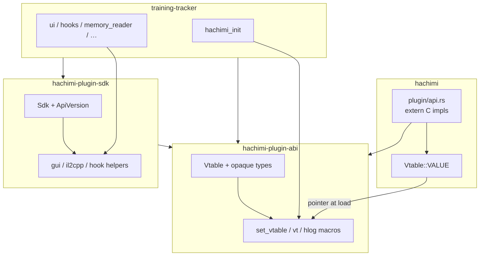

# Consolidated plan — Hachimi plugin SDK

**Status**: Canonical implementation plan  
**Date**: 2026-05-23  
**Supersedes**: [.plans/hachimi-plugin-sdk.md](hachimi-plugin-sdk.md) (single-crate baseline)  
**Vote summary**: [.plans/hachimi-plugin-sdk-comparison.md](hachimi-plugin-sdk-comparison.md)  
**Alternatives archived**: Alt A (manifest), Alt B (split), Alt C (abi-only) — see `.plans/hachimi-plugin-sdk-alt-*.md`

Phases are **sequential checkpoints**. After each: `cargo build`, `cargo test`, `cargo clippy`. Batch size is flexible; order is not.

---

## 1. Decision record

Three agents ranked four proposals (maintainer, plugin author, ABI engineer).

| Outcome | Detail |
|---------|--------|
| **Winner** | Hybrid of **Baseline** (Sdk + safe wrappers) and **Alt B** (split crates) |
| **Votes** | Baseline #1 ×2; Alt B tied on Borda (6 pts); Alt A #1 for ABI-only lens |
| **Rejected for now** | **Alt C** (abi-only defer) — fixes drift but leaves ~138 raw `(vt.slot)(…)` calls and ad-hoc version checks |
| **Deferred** | **Alt A** (manifest codegen) — adopt when slot/API churn or ≥2 in-tree plugins justify CI codegen |

**Consolidated strategy**

1. **`hachimi-plugin-abi`** — stable wire types, `Vtable`, `set_vtable` / `vt()`, `hlog!` macros, layout tests. Host depends **only** on this.
2. **`hachimi-plugin-sdk`** — `Sdk`, `ApiVersion`, safe wrappers (`gui`, `il2cpp`, `hook`). Depends on `abi`; plugins depend on **both**.
3. **Checkpoint after Phase 2** — mirror drift eliminated before any ergonomics work.
4. **Manual `Vtable`** in `abi` for now; **Alt A trigger** documented in §12.

---

## 2. Problem statement

| Location | Problem |
|----------|---------|
| `plugins/training-tracker/src/vtable.rs` | ~234-line manual mirror of host `Vtable` — drift risk |
| `src/core/plugin/api.rs` | Source of truth not consumable by plugins at compile time |
| Plugin modules | ~138 raw `(vt.slot)(…)` + repetitive `unsafe` / `CString` |
| Docs | `hachimi-plugin-surface.md` stale (version 2 / 52 slots vs code **7 / 57**) |

**Unchanged**: runtime wire format — flat `#[repr(C)] Vtable`, `extern "C" fn hachimi_init(*const Vtable, i32) -> i32`.

---

## 3. Goals

1. **Single `Vtable` definition** in `hachimi-plugin-abi` (only place).
2. **Delete** `plugins/training-tracker/src/vtable.rs` by Phase 2 done.
3. **`hachimi-plugin-sdk`** — `Sdk`, `ApiVersion`, safe wrappers; incremental migration in training-tracker.
4. **ABI tests** in `abi` crate (`size_of`, 57 slots, `Copy`).
5. **Workspace** — root + `crates/*` + `plugins/training-tracker`.
6. **Docs** — API version 7, 57 slots, two-crate dependency story.

## 4. Non-goals

- C wire ABI change, sub-vtables (v8), proc-macro `#[hachimi_plugin]`, crates.io publish.
- Generating host `extern "C"` bodies (stay in `api.rs`).
- Manifest codegen until §12 trigger fires.
- Migrating 100% of call sites before Phase 4 is allowed to complete — module-by-module is fine.

---

## 5. Target architecture



### Workspace layout

```
Hachimi-Edge/
  Cargo.toml                    # [workspace] members below
  crates/
    hachimi-plugin-abi/
      src/
        lib.rs                  # Vtable, types, init, log macros
        version.rs              # API_VERSION + version constants
      tests/abi_layout.rs
    hachimi-plugin-sdk/
      src/
        lib.rs                  # pub use abi::*; Sdk; submodules
        sdk.rs
        version.rs              # ApiVersion::supports_*()
        gui.rs
        il2cpp.rs
        hook.rs
  src/core/plugin/api.rs        # uses abi types; implements slots
  plugins/training-tracker/     # abi + sdk path deps; no vtable.rs
```

### Dependency rules

| Crate | Depends on | Must NOT depend on |
|-------|------------|-------------------|
| `hachimi-plugin-abi` | `std` only | `hachimi`, `egui`, `il2cpp`, `hachimi-plugin-sdk` |
| `hachimi-plugin-sdk` | `hachimi-plugin-abi` | `hachimi`, `egui`, `il2cpp` |
| `hachimi` (root) | `hachimi-plugin-abi` | `hachimi-plugin-sdk` |
| `hachimi-training-tracker` | `abi`, `sdk` | `hachimi` |

Plugins link **rlibs** into their own `cdylib`; they never link `hachimi.dll`.

### Vtable ABI (append-only)

- **57** function pointers, **`API_VERSION = 7`**.
- New slots **append at end**; bump `API_VERSION`; extend `ApiVersion::supports_*()`; update tests and docs.
- Slot map: see [.plans/hachimi-plugin-sdk.md §4](hachimi-plugin-sdk.md) (unchanged).

### Host signature rule

`abi` defines opaque types (`pub type Il2CppClass = c_void`, …). Host `extern "C"` fns in `api.rs` use **abi opaque types** in signatures; cast to `crate::il2cpp::types::*` inside bodies only.

### API layers for plugin authors

| Layer | Crate | Use when |
|-------|-------|----------|
| Raw `vt().slot(...)` | `abi` | Escape hatch, rare |
| `Sdk::get().gui_small(ui, "…")` | `sdk` | Default for new/edited code |
| `hlog_info!(…)` | `abi` (re-exported by `sdk`) | Logging |

---

## 6. Implementation phases

### Phase 0 — Workspace + `hachimi-plugin-abi`

1. Root `Cargo.toml`:
   ```toml
   [workspace]
   resolver = "2"
   members = [
     ".",
     "crates/hachimi-plugin-abi",
     "crates/hachimi-plugin-sdk",
     "plugins/training-tracker",
   ]
   ```
2. Create `hachimi-plugin-abi` with full `Vtable` (from host `api.rs`), opaque types, `InitResult`, callback aliases, `API_VERSION = 7`.
3. `init.rs`: `set_vtable`, `vt()`, `try_vt()`.
4. `log.rs`: `hlog!`, `hlog_info!`, … (`#[macro_export]`).
5. `tests/abi_layout.rs`: `size_of == 57 * size_of::<usize>()`, `Copy`.
6. Stub `hachimi-plugin-sdk` crate (empty `lib.rs` re-exporting abi only) so workspace resolves.
7. Root: `hachimi-plugin-abi = { path = "crates/hachimi-plugin-abi" }`.

**Acceptance**: `cargo build -p hachimi-plugin-abi && cargo test -p hachimi-plugin-abi`; host still builds unchanged.

---

### Phase 1 — Host on `abi`

1. `src/core/plugin/api.rs`: import `hachimi_plugin_abi::{Vtable, API_VERSION, …}`; remove local `struct Vtable`.
2. Opaque signatures on all `extern "C"` shims; internal casts to il2cpp types.
3. `types.rs`: `HachimiInitFn`, callbacks, `InitResult` from `abi` (`pub use` in `plugin/mod.rs`).
4. `init_plugin` passes `hachimi_plugin_abi::API_VERSION`.
5. Remove duplicate vtable layout test from host (keep in `abi`).

**Acceptance**: Host tests pass; runtime ABI byte-identical to today.

---

### Phase 2 — Plugin on `abi`; delete mirror ⭐ checkpoint

1. `plugins/training-tracker/Cargo.toml`: `hachimi-plugin-abi = { path = "../../crates/hachimi-plugin-abi" }`.
2. Delete `src/vtable.rs`.
3. `lib.rs`: `hachimi_plugin_abi::set_vtable(...)`; macros from `abi`.
4. Mechanical rename: `crate::vtable::` → `hachimi_plugin_abi::`.
5. Smoke test: plugin loads in game, init log + notification.

**Acceptance**: No `mod vtable`; plugin DLL builds; **drift class of bugs eliminated**.

---

### Phase 3 — `hachimi-plugin-sdk` core

1. Implement `sdk` crate: `Sdk`, `InitError`, `ApiVersion` with `supports_overlay`, `supports_overlay_visibility`, `supports_collapsing`, `supports_font_size`.
2. `Sdk::init(ptr, version)` → stores vtable + version; `Sdk::get()` / `try_get()`.
3. `pub use hachimi_plugin_abi::*` from `sdk` lib root for ergonomic `use hachimi_plugin_sdk::…`.
4. training-tracker: add `sdk` path dep; `lib.rs` uses `Sdk::init`; `ui.rs` drops `API_VERSION` atomic + raw `>= N` literals.
5. Re-export `hlog_*` from sdk.

**Acceptance**: Overlay/font/visibility behavior unchanged; version gating only via `ApiVersion`.

---

### Phase 4 — Safe wrappers (incremental)

Migrate training-tracker **one module at a time**; do not block completion of other modules.

| Order | Module | Wrapper focus |
|-------|--------|----------------|
| 1 | `lib.rs` + logging | `Sdk::log_*` / macros |
| 2 | `ui.rs` | `gui_small`, `register_overlay`, font/min_width, etc. |
| 3 | `memory_reader.rs`, `skill_shop.rs` | `il2cpp::*` helpers |
| 4 | `hooks.rs` | `hook::*` helpers |
| 5 | `diagnostics.rs` | Mixed leftovers |

**Per-module acceptance**: fewer `CString::new` at call sites; `unsafe` confined to `sdk`/`abi` internals; clippy clean.

**Keep** `vt()` for unmigrated lines until touched.

---

### Phase 5 — Docs and developer ergonomics

1. `docs/architecture.md` — two crates, dependency rules.
2. `docs/reverse-engineering/hachimi-plugin-surface.md` — version **7**, **57** slots, init example using `abi` + `sdk`.
3. `crates/hachimi-plugin-abi/README.md` — minimal plugin (abi-only path).
4. `crates/hachimi-plugin-sdk/README.md` — recommended `Sdk::init` template.
5. `plugins/training-tracker/docs/developing.md` — `cargo build -p hachimi-training-tracker` from repo root.
6. `docs/build-and-deployment.md` — workspace commands.

**Acceptance**: New plugin author can copy path deps and init pattern without reading host source.

---

### Phase 6 — ABI guardrails (lightweight, optional)

Not manifest codegen — grep/CI discipline only:

1. `scripts/check-plugin-api.sh` (or `xtask`): assert host `api.rs` `Vtable::VALUE` field count matches `abi` test constant; fail if `API_VERSION` not bumped when `Vtable` field count changes.
2. Optional host test: `size_of::<hachimi_plugin_abi::Vtable>()` re-export check.

**Acceptance**: CI/local script catches forgotten slot/`API_VERSION` pairs.

---

## 7. Public API summary

### `hachimi-plugin-abi`

```rust
pub const API_VERSION: i32 = 7;
#[repr(C)] pub struct Vtable { /* 57 fields */ }
#[repr(i32)] pub enum InitResult { Error = 0, Ok = 1 }
pub type HachimiInitFn = extern "C" fn(*const Vtable, i32) -> InitResult;
// opaque types, Gui*Callback aliases
pub unsafe fn set_vtable(ptr: *const Vtable);
pub fn vt() -> &'static Vtable;
// hlog_info!, etc.
```

### `hachimi-plugin-sdk`

```rust
pub struct Sdk { /* … */ }
impl Sdk {
    pub unsafe fn init(vtable_ptr: *const Vtable, version: i32) -> Result<Self, InitError>;
    pub fn get() -> &'static Sdk;
    pub fn version(&self) -> ApiVersion;
    pub fn gui_small(&self, ui: *mut c_void, text: &str);
    // il2cpp / hook helpers in submodules
}
```

### Plugin entry (target)

```rust
#[no_mangle]
pub extern "C" fn hachimi_init(vtable_ptr: *const c_void, version: i32) -> i32 {
    match unsafe { Sdk::init(vtable_ptr as *const Vtable, version) } {
        Ok(_) => { /* register ui, hooks */ InitResult::Ok as i32 }
        Err(_) => InitResult::Error as i32,
    }
}
```

---

## 8. Adding slot 58+

1. Append field to `hachimi_plugin_abi::Vtable`.
2. Implement host `extern "C"` in `api.rs`; add to `Vtable::VALUE`.
3. `API_VERSION += 1`; add `ApiVersion::supports_*()` in `sdk`.
4. Bump `abi` test `57` → `58`.
5. Update `hachimi-plugin-surface.md`.
6. Run Phase 6 check script.

---

## 9. Risks and mitigations

| Risk | Mitigation |
|------|------------|
| Layout mismatch host/plugin | Single `Vtable` in `abi`; tests before Phase 2 |
| Wrong opaque casts in host | Review per shim; cast only at il2cpp boundary |
| Two-crate confusion | `sdk` re-exports `abi`; README on each crate |
| `Sdk::get()` before init | `debug_assert`; `try_get()` for optional paths |
| Over-abstracted wrappers | Only add helpers that remove real duplication |
| Android plugin target | Verify `training-tracker` `.so` build after Phase 2 |

---

## 10. Effort estimate

| Phase | Hours | Cumulative value |
|-------|-------|------------------|
| 0 | 1–2 | Workspace + abi tests |
| 1 | 2–3 | Host unified types |
| 2 | 1–2 | **Drift fixed** |
| 3 | 2 | Sdk + version API |
| 4 | 4–8 | Author ergonomics |
| 5 | 1 | Docs |
| 6 | 1–2 | CI guardrails (optional) |
| **Total** | **~12–20 h** | |

---

## 11. Definition of done

- [ ] `hachimi-plugin-abi` is the **only** `Vtable` definition.
- [ ] Host depends on `abi` only; does not depend on `sdk`.
- [ ] `hachimi-plugin-sdk` provides `Sdk`, `ApiVersion`, and wrappers; depends on `abi`.
- [ ] `plugins/training-tracker` has no `vtable.rs`.
- [ ] `ui.rs` / `lib.rs` use `Sdk` and `ApiVersion` (no scattered `>= N`).
- [ ] Docs: API v7, 57 slots, workspace build instructions.
- [ ] `cargo test -p hachimi-plugin-abi` in routine checks.
- [ ] Game smoke test: plugin init, overlay, tracking path still works.

---

## 12. Future triggers (from voted alternatives)

| Trigger | Action |
|---------|--------|
| Second in-tree plugin or third-party plugin | Harden Phase 6 script; document abi-only template |
| ≥3 plugins or frequent slot additions | Implement **Alt A** manifest → codegen on `abi` crate ([alt-a plan](hachimi-plugin-sdk-alt-a-manifest-codegen.md)) |
| Need minimal plugin binary / no wrappers | New plugin depends on `abi` only; optional `sdk` |
| `API_VERSION = 8` sub-vtables | Separate design issue; append-only flat table until then |
| `#[hachimi_plugin]` proc-macro | Optional ergonomics; not required for drift fix |

---

## 13. Related docs

| Doc | Role |
|-----|------|
| [hachimi-plugin-sdk-comparison.md](hachimi-plugin-sdk-comparison.md) | Vote results |
| [hachimi-plugin-sdk.md](hachimi-plugin-sdk.md) | Original single-crate baseline (reference) |
| [../docs/plans/plugin-sdk-refactor.md](../docs/plans/plugin-sdk-refactor.md) | Host `plugin/` module split (done) |
| [../docs/reverse-engineering/hachimi-plugin-surface.md](../docs/reverse-engineering/hachimi-plugin-surface.md) | Public API surface (update in Phase 5) |
