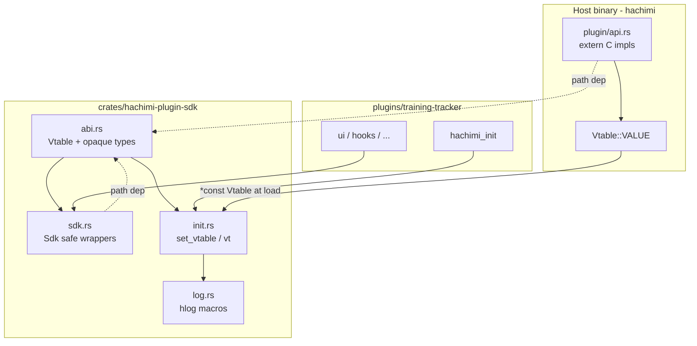

# `hachimi-plugin-sdk` crate refactor plan

**Status**: Superseded by [hachimi-plugin-sdk-consolidated.md](hachimi-plugin-sdk-consolidated.md) (2026-05-23 vote + hybrid plan)  
**Date**: 2026-05-23  
**Related**: [docs/plans/plugin-sdk-refactor.md](../docs/plans/plugin-sdk-refactor.md) (host-side domain split — largely done), [docs/reverse-engineering/hachimi-plugin-surface.md](../docs/reverse-engineering/hachimi-plugin-surface.md)

Phases are **sequential checkpoints**, not packaging units. Work through them in order; stop after any phase once its acceptance criteria pass (`cargo build`, `cargo test`, `cargo clippy`). Phases can be split or combined as needed — the order matters more than batch size.

---

## 1. Problem statement

Plugins today reimplement the host ABI by hand:

| Location | Role | Risk |
|----------|------|------|
| `src/core/plugin/api.rs` | Host builds `Vtable::VALUE`, passes pointer at `hachimi_init` | Source of truth, but not consumable by plugins |
| `plugins/training-tracker/src/vtable.rs` | ~234-line mirror + `set_vtable` / `vt()` / `hlog!` macros | **Manual sync**; comment still references deleted `plugin_api.rs` |
| Plugin modules (`ui`, `memory_reader`, `hooks`, …) | ~138 direct `(vt.slot)(...)` calls | Repetitive `unsafe`, CString boilerplate, no version helpers |

The wire format (flat `#[repr(C)]` vtable + `hachimi_init`) stays. The refactor extracts a **shared Rust crate** so plugins get typed imports, one ABI definition, and optional safe wrappers — without linking the host `hachimi` binary.

---

## 2. Goals

1. **Single ABI definition** — `Vtable`, opaque FFI types, callback aliases, `InitResult`, `API_VERSION` live in one crate used by host and plugins.
2. **Delete per-plugin `vtable.rs`** — training-tracker (and future plugins) depend on `hachimi-plugin-sdk` via path/workspace.
3. **Ergonomic plugin API** — `Sdk` struct with safe methods (`gui_small`, `log_info`, `resolve_class`, …) hiding CString + `unsafe` at call sites.
4. **ABI regression tests** in the SDK crate (size, `Copy`, field count, optional layout assertions).
5. **Document version gates** in the SDK (`ApiFeature` or constants matching host `VERSION = 7`).

## 3. Non-goals (this plan)

- Changing the C wire ABI (field order, count, or `hachimi_init` signature).
- Sub-vtables / `VERSION = 8` redesign (defer to follow-up).
- Proc-macro `#[hachimi_plugin]` (optional later).
- Publishing to crates.io (in-repo path dependency only for now).
- Replacing host `plugin/api.rs` FFI implementations — only **type ownership** moves; host keeps ~900 lines of `extern "C"` shims.

---

## 4. Current state audit (2026-05-23)

### Host (`src/core/plugin/`)

- `api.rs`: `const VERSION: i32 = 7`, `Vtable` (57 fn pointers), `Vtable::VALUE`, `init_plugin`, vtable size test.
- `types.rs`: `HachimiInitFn`, `InitResult`, `Plugin`, GUI callback type aliases — references `api::Vtable`.
- `overlay.rs`, `menu.rs`, `notification.rs`: plugin GUI state (refactor from `docs/plans/plugin-sdk-refactor.md` is in place).

### Plugin (`plugins/training-tracker/`)

- Standalone `Cargo.toml` (not in a workspace today).
- `vtable.rs`: duplicate `Vtable` + globals + logging macros.
- `lib.rs`: `hachimi_init` → `vtable::set_vtable`.
- Version checks scattered in `ui.rs`: `>= 3` overlay, `>= 5` visibility, `>= 6` collapsing, `>= 7` font size.
- Heavy raw vtable use: `ui` (~48), `memory_reader` (~21), `diagnostics` (~18), `hooks` (~10), `skill_shop` (~11).

### Drift already possible

- Host `il2cpp_create_array` uses `il2cpp_array_size_t` (= `usize` in `src/il2cpp/types.rs`); plugin mirror uses `usize` — same ABI today, different Rust names.
- Docs (`hachimi-plugin-surface.md`) still say API version 2 / 52 slots — stale vs code (7 / 57).

### Vtable slot map (append-only ABI)

```
Slots 1–2:   hachimi_instance, hachimi_get_interceptor
Slots 3–6:   interceptor_* (4)
Slots 7–29:  il2cpp_* (23)
Slot 30:     log
Slots 31–41: gui menu/widgets (11)
Slots 42–45: gui_register_*_icon, menu_section_with_icon (2+2 in doc grouping)
Slots 46–49: android_dex_* (4) — v2+
Slot 50:     gui_register_overlay — v3+
Slot 51:     gui_ui_set_min_width — v4+
Slot 52:     gui_overlay_set_visible — v5+
Slot 53:     gui_ui_set_font_size — v7+  (note: v6 slot is collapsing, v7 is font)
Slot 54:     gui_ui_collapsing — v6+
```

**Rule**: New capabilities append at end; bump `API_VERSION` and document in SDK.

---

## 5. Target architecture



### Workspace layout

```
Hachimi-Edge/
  Cargo.toml                 # [workspace] members = [".", "crates/hachimi-plugin-sdk", "plugins/training-tracker"]
  crates/
    hachimi-plugin-sdk/
      Cargo.toml
      src/
        lib.rs
        abi.rs          # Vtable, opaque types, API_VERSION, InitResult, callbacks
        version.rs      # ApiVersion, feature constants (V3_OVERLAY, …)
        init.rs         # set_vtable, vt, Sdk::from_init
        sdk.rs          # Sdk + safe wrappers (phased)
        log.rs          # log_level + hlog_* macros (re-export at crate root)
        gui.rs          # optional: overlay/menu registration helpers
        il2cpp.rs       # optional: class/method/field helpers
        hook.rs         # optional: interceptor helpers
      tests/
        abi_layout.rs
  src/core/plugin/api.rs   # imports abi from SDK; keeps FFI impls only
  plugins/training-tracker/  # depends on hachimi-plugin-sdk; no vtable.rs
```

### Crate dependency rules

| Crate | Depends on | Must NOT depend on |
|-------|------------|-------------------|
| `hachimi-plugin-sdk` | `std` only (optional: `cstr` if useful) | `hachimi`, `egui`, `il2cpp` |
| `hachimi` (root) | `hachimi-plugin-sdk` | — |
| `hachimi-training-tracker` | `hachimi-plugin-sdk` | `hachimi` |

No circular dependencies.

---

## 6. Design decisions

### 6.1 Single source: shared crate, not codegen (phase 1)

**Decision**: Move `Vtable` and types into `hachimi-plugin-sdk` manually. Host `api.rs` and plugins import the same struct.

**Rationale**: Only one in-tree plugin today; 57 fields are manageable; host refactor already centralized `api.rs`. Codegen (`build.rs` + manifest) is phase 2 **only if** drift recurs after multiple plugins.

**Host signature alignment**: SDK defines all IL2CPP/host types as **opaque** (`pub type Il2CppClass = c_void`, etc.). Host `extern "C"` implementations in `api.rs` use SDK opaque types in signatures and cast to internal `crate::il2cpp::types::*` inside function bodies. Avoids 57 shim functions and keeps one `Vtable` struct.

### 6.2 `Sdk` vs raw `vt()`

| Layer | Who uses it | Purpose |
|-------|-------------|---------|
| `Sdk::global()` / `Sdk::get()` | Plugin application code | Safe wrappers, version checks |
| `vt()` / `&Vtable` | SDK internals, advanced plugins | Escape hatch; same as today |
| Raw `hachimi_init` export | `lib.rs` only | Stable C entry point |

Migrate training-tracker **incrementally**: Phase B keeps `vt()` working via `hachimi_plugin_sdk::vt()`; Phase C replaces call sites module-by-module.

### 6.3 Version gating in SDK

Replace magic `if api_version >= 5` with:

```rust
// version.rs
pub const API_VERSION: i32 = 7;

pub struct ApiVersion(i32);

impl ApiVersion {
    pub fn new(v: i32) -> Self { Self(v) }
    pub fn supports_overlay(&self) -> bool { self.0 >= 3 }
    pub fn supports_overlay_visibility(&self) -> bool { self.0 >= 5 }
    pub fn supports_collapsing(&self) -> bool { self.0 >= 6 }
    pub fn supports_font_size(&self) -> bool { self.0 >= 7 }
}
```

`Sdk::init(ptr, version)` stores `ApiVersion` alongside the vtable.

### 6.4 Logging macros

Move `hlog!`, `hlog_info!`, … into SDK as `#[macro_export]` with configurable target:

```rust
hachimi_plugin_sdk::hlog_info!(target: "training-tracker", "...");
```

Or `Sdk::log_info(target, msg)` for non-macro sites. Remove `#[macro_use] mod vtable` from plugin `lib.rs`.

### 6.5 Host `plugin/types.rs`

- `HachimiInitFn`, callback aliases: re-export from `hachimi_plugin_sdk` (or define once in SDK, host `pub use`).
- `Plugin`, `init_plugin`: stay host-only; `init_plugin` uses `hachimi_plugin_sdk::API_VERSION`.

### 6.6 `lib` + `cdylib` for SDK

- **`hachimi-plugin-sdk`**: `crate-type = ["lib"]` only (rlib for compile-time linking).
- **Plugins**: keep `["cdylib", "lib"]` for tests.
- **Host**: unchanged `cdylib` + `lib`.

Plugins still do **not** link `hachimi.dll`; they link the SDK rlib into their own `.dll`.

---

## 7. Public API sketch (`hachimi-plugin-sdk`)

### Phase A — ABI only (minimum viable)

```rust
// abi.rs
pub const API_VERSION: i32 = 7;
#[repr(C)] pub struct Vtable { /* 57 fields */ }
#[repr(i32)] pub enum InitResult { Error = 0, Ok = 1 }
pub type HachimiInitFn = extern "C" fn(*const Vtable, i32) -> InitResult;
// opaque types + callback aliases

// init.rs
pub unsafe fn set_vtable(ptr: *const Vtable);
pub fn vt() -> &'static Vtable;
pub fn try_vt() -> Option<&'static Vtable>;

// lib.rs
pub use abi::*;
pub use init::*;
pub mod log; // macros
```

### Phase B — `Sdk` core

```rust
pub struct Sdk {
    version: ApiVersion,
}

impl Sdk {
    pub unsafe fn init(vtable_ptr: *const Vtable, version: i32) -> Result<Self, InitError>;
    pub fn get() -> &'static Sdk;
    pub fn version(&self) -> ApiVersion;
    pub fn log_info(&self, msg: &str);
    pub fn gui_small(&self, ui: *mut c_void, text: &str);
    // … grouped by domain
}
```

### Phase C — Domain modules (thin helpers)

- `il2cpp::resolve_class(image, ns, class) -> Option<*mut Il2CppClass>`
- `hook::install_method(interceptor, klass, name, argc, hook_fn) -> Option<usize>`
- `gui::register_overlay(id, callback, userdata)` with `CStr` handling

Keep helpers small; no new abstractions unless they remove >10 lines at each call site.

---

## 8. Implementation phases

After each phase: `cargo build`, `cargo test`, `cargo clippy` (zero warnings per repo policy).

### Phase 0 — Workspace scaffolding

**Changes**

1. Root `Cargo.toml` add:
   ```toml
   [workspace]
   resolver = "2"
   members = [".", "crates/hachimi-plugin-sdk", "plugins/training-tracker"]
   ```
2. Create `crates/hachimi-plugin-sdk/` with `abi.rs` copied from host `Vtable` (opaque types), `API_VERSION = 7`, tests (`size_of`, `Copy`, field count = 57).
3. Root `hachimi` package: `[dependencies] hachimi-plugin-sdk = { path = "crates/hachimi-plugin-sdk" }`.

**Acceptance**

- `cargo build -p hachimi-plugin-sdk`
- `cargo test -p hachimi-plugin-sdk`
- Host still builds (no behavior change yet).

---

### Phase 1 — Host uses SDK types

**Changes**

1. `src/core/plugin/api.rs`: `use hachimi_plugin_sdk::{Vtable, API_VERSION, ...}`; delete local `struct Vtable`.
2. Change host `extern "C"` fn signatures to SDK opaque pointer types; cast inside bodies to existing `il2cpp` types.
3. `types.rs`: `use hachimi_plugin_sdk::{Vtable, HachimiInitFn, InitResult, ...}`.
4. `mod.rs`: `pub use hachimi_plugin_sdk::API_VERSION` (or `VERSION` alias).
5. Move vtable layout tests to SDK crate; host test `use hachimi_plugin_sdk::Vtable` or delete duplicate.

**Acceptance**

- Byte-identical `Vtable` layout (same `size_of`, same field order).
- `cargo test` all host tests pass.
- No change to loaded plugin ABI at runtime.

---

### Phase 2 — Plugin depends on SDK; delete `vtable.rs`

**Changes**

1. `plugins/training-tracker/Cargo.toml`: `hachimi-plugin-sdk = { path = "../../crates/hachimi-plugin-sdk" }`.
2. Delete `plugins/training-tracker/src/vtable.rs`.
3. `lib.rs`: `use hachimi_plugin_sdk::{set_vtable, hlog_info, InitResult, Vtable}`; `#[macro_use] extern crate hachimi_plugin_sdk` or `use hachimi_plugin_sdk::hlog_info`.
4. Mechanical replace: `crate::vtable::` → `hachimi_plugin_sdk::`, `vtable::vt()` → `hachimi_plugin_sdk::vt()`.

**Acceptance**

- Plugin DLL builds for Windows target.
- Deployed plugin loads and logs init (manual smoke test).
- Zero references to `mod vtable` in training-tracker.

---

### Phase 3 — Introduce `Sdk` + version helpers

**Changes**

1. Implement `Sdk`, `ApiVersion`, `InitError` in SDK.
2. `lib.rs`: `Sdk::init(vtable_ptr as *const Vtable, version)?` instead of raw `set_vtable` only.
3. `ui.rs`: replace `API_VERSION` atomic + magic numbers with `Sdk::get().version().supports_*()`.

**Acceptance**

- Overlay / font / visibility behavior unchanged.
- `ui.rs` has no raw `>= N` literals except inside `version.rs`.

---

### Phase 4 — Safe wrappers (incremental migration)

**Order** (highest churn first):

1. `log` — all `hlog_*` call sites
2. `gui` — `ui.rs` (labels, buttons, overlay registration)
3. `il2cpp` — `memory_reader.rs`, `skill_shop.rs`
4. `hook` — `hooks.rs`
5. `diagnostics.rs` — mixed; migrate last

**Per-module acceptance**

- No new `CString::new` at call sites where wrapper accepts `&str`.
- `unsafe` blocks shrink to SDK internals only.
- Clippy `undocumented_unsafe_blocks` satisfied in plugin code.

**Do not** block Phase 4 on 100% migration — finish one module at a time (`log` → `gui` → `il2cpp` → `hook` → `diagnostics`).

---

### Phase 5 — Docs, CI, developer ergonomics

**Changes**

1. Update `docs/architecture.md`, `docs/reverse-engineering/hachimi-plugin-surface.md` (version 7, 57 slots, SDK crate path).
2. Add `crates/hachimi-plugin-sdk/README.md` — minimal plugin template `hachimi_init`, `Sdk::init`, register overlay.
3. `plugins/training-tracker/docs/developing.md` — build via `cargo build -p hachimi-training-tracker` from workspace root.
4. `docs/build-and-deployment.md` — workspace build commands.
5. Optional CI step: `cargo test -p hachimi-plugin-sdk && cargo build -p hachimi-training-tracker`.

**Acceptance**

- New contributor can create a plugin by copying training-tracker `Cargo.toml` path dep pattern.

---

## 9. ABI safety net

### Tests in `hachimi-plugin-sdk`

```rust
#[test]
fn vtable_size_is_stable() {
    assert_eq!(size_of::<Vtable>(), 57 * size_of::<usize>());
}

#[test]
fn vtable_is_copy() { /* ... */ }

#[test]
fn api_version_matches_slot_count_doc() {
    assert_eq!(API_VERSION, 7);
}
```

### Optional follow-up (Phase 6)

- `tests/abi_compat.rs` in host: `assert_eq!(size_of::<hachimi_plugin_sdk::Vtable>(), size_of::<...>())` — redundant if single struct, but documents intent.
- `xtask` or `scripts/check-vtable-sync.rs` — fail if host `api.rs` field names/count diverge from SDK without `API_VERSION` bump (grep-based check, not full codegen).

### When adding slot 58

1. Append field to `hachimi_plugin_sdk::abi::Vtable`.
2. Implement host `extern "C"` fn in `api.rs`, add to `Vtable::VALUE`.
3. `API_VERSION += 1`, `ApiVersion::supports_*()` for new feature.
4. Update `hachimi-plugin-surface.md` version table.
5. Fix test `57` → `58`.

---

## 10. Risk analysis

| Risk | Impact | Mitigation |
|------|--------|------------|
| Host/plugin `Vtable` layout mismatch | Critical crash | Single struct in SDK; one size test; Phase 1 before plugin switch |
| Opaque vs real pointer types in host shims | Wrong casts | Code review per `extern "C"` fn; use `as` only at il2cpp boundary |
| Workspace breaks standalone plugin build | DX regression | Document `cargo build -p …` from root; keep path dep |
| `Sdk::get()` before init | UB / panic | `debug_assert` + `try_vt()` for optional paths; document init order |
| Over-abstracted SDK | Harder to read | Phase 4 wrappers only where they remove real duplication |
| Android cross-compile | Plugin builds for `.so` | SDK is platform-agnostic; verify `training-tracker` Android target in Phase 2 |

---

## 11. Relationship to host plugin refactor

| `plugin-sdk-refactor.md` | This plan |
|--------------------------|-----------|
| Split `gui.rs` plugin state into `plugin/overlay`, `menu`, `notification` | **Prerequisite done** — proceed |
| Keep flat vtable ABI | **Same** — no wire change |
| “vtable.rs stays identical” in Phase 5 | **Superseded** — delete mirror, use SDK crate |

Host refactor organized **host internals**; this plan organizes **plugin-facing SDK**.

---

## 12. Future work (out of scope)

- **`API_VERSION = 8` sub-vtables** — pointer to `{ gui: *const GuiVtable, il2cpp: *const ... }` appended at end (see old plan §2).
- **`#[hachimi_plugin]` proc macro** — export `hachimi_init`, call user `fn init(sdk: &Sdk)`.
- **Manifest codegen** — `plugin-api.toml` → generate `abi.rs` when ≥3 plugins exist.
- **Publish `hachimi-plugin-sdk` to crates.io** — if third-party plugins appear.

---

## 13. Effort estimate

| Phase | Effort | Risk |
|-------|--------|------|
| 0 Workspace + SDK scaffold | 1–2 h | Low |
| 1 Host imports SDK | 2–3 h | Medium (signature casts) |
| 2 Plugin path dep, delete vtable.rs | 1–2 h | Low |
| 3 Sdk + ApiVersion | 2 h | Low |
| 4 Safe wrappers (incremental) | 4–8 h | Medium |
| 5 Docs / CI | 1 h | Low |
| **Total** | **~12–18 h** | |

---

## 14. Definition of done

- [ ] `crates/hachimi-plugin-sdk` exists and is the **only** `Vtable` definition.
- [ ] Host `api.rs` implements slots; does not redefine `Vtable`.
- [ ] `plugins/training-tracker` has no `vtable.rs`; depends on path crate.
- [ ] `API_VERSION` exported from SDK; docs say 7 / 57 slots.
- [ ] Training-tracker builds from workspace; smoke test in game passes.
- [ ] At least `ui.rs` and `lib.rs` use `Sdk` / version helpers (Phase 3+).
- [ ] ABI tests run in `cargo test -p hachimi-plugin-sdk`.
